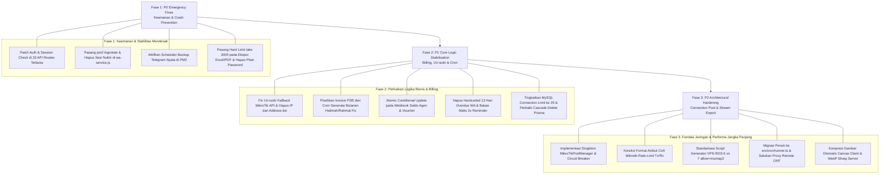

# 🛡️ LAPORAN MASTER AUDIT ARSITEKTUR & SISTEM PRODUKSI
## EugineBill RADIUS ISP Platform — v2.35.0
**Tanggal Audit:** 3 September 2026  
**Auditor:** Senior Full Stack Architect & Senior IT Infrastructure (Antigravity SRE Team)  
**Tujuan:** *Audit komprehensif seluruh basis kode untuk menemukan bug tersembunyi, kejanggalan logika, celah keamanan, bottleneck performa, dan menyusun roadmap teknis agar sistem billing PASTI tetap berjalan stabil 24/7 tanpa henti.*

---

## DAFTAR ISI
1. [Executive Summary & Health Scorecard](#1-executive-summary--health-scorecard)
2. [Domain 1: Keandalan 24/7 & Ketahanan Operasional (SRE Resilience)](#2-domain-1-keandalan-247--ketahanan-operasional-sre-resilience)
3. [Domain 2: Modul Jaringan, MikroTik, RADIUS & Remote ONT](#3-domain-2-modul-jaringan-mikrotik-radius--remote-ont)
4. [Domain 3: Billing, Invoicing, Cron Jobs & Payment Gateways](#4-domain-3-billing-invoicing-cron-jobs--payment-gateways)
5. [Domain 4: Database (Prisma), Keamanan & Autentikasi API](#5-domain-4-database-prisma-keamanan--autentikasi-api)
6. [Domain 5: Frontend, PWA, File Uploads & Memori PM2](#6-domain-5-frontend-pwa-file-uploads--memori-pm2)
7. [Master Roadmap Remediasi & Action Plan](#7-master-roadmap-remediasi--action-plan)

---

## 1. EXECUTIVE SUMMARY & HEALTH SCORECARD

Berdasarkan audit mendalam baris demi baris (*line-by-line inspection*) pada 100+ file backend, cron worker, gateway pembayaran, skema database, dan handler jaringan, **EugineBill memiliki fitur bisnis ISP yang sangat kaya dan fungsional**. Namun, terdapat **kerentanan arsitektural laten tingkat P0 (High Severity)** yang jika dibiarkan berjalan berbulan-bulan di VPS produksi, dipastikan akan memicu kegagalan sistem fatal (*cascading failure*).

### 📊 Health Scorecard Berdasarkan Domain

| Domain Evaluasi | Skor (1-10) | Status Risiko | Temuan Utama |
|---|:---:|:---:|---|
| **SRE & 24/7 Survivability** | **5.0 / 10** | 🔴 **CRITICAL** | PM2 log tidak dirotasi (risiko disk penuh), backup Telegram mati suri, un-isolir silent failure. |
| **Jaringan & MikroTik** | **5.5 / 10** | 🔴 **CRITICAL** | 28+ socket ad-hoc tanpa connection pool, CoA rate-limit terbalik, sintaks VPN ROS error. |
| **Billing & Gateways** | **6.0 / 10** | 🟠 **HIGH** | Halimah/Rahmat prorate bug terungkap, race condition double-credit agen, WhatsApp spam blast. |
| **Database & API Security** | **4.5 / 10** | 🔴 **CRITICAL** | **33 API administratif/internal terbuka tanpa login**, missing cascade delete di Prisma. |
| **Frontend & Performa Memori** | **6.5 / 10** | 🟠 **HIGH** | Batas PM2 450MB rentan OOM crash saat export Excel/PDF, upload foto raw 10MB tanpa kompresi. |

---

## 2. DOMAIN 1: KEANDALAN 24/7 & KETAHANAN OPERASIONAL (SRE RESILIENCE)

### 2.1. Bug Pembukaan Isolir: Pelanggan Sudah Bayar Tetapi Tetap Terisolir
* **File:** `src/server/services/radius/coa-handler.service.ts` (Baris 320–330) & `src/app/api/payment/webhook/route.ts` (Baris 1736)
* **Akar Masalah:**
  1. Saat pelanggan terisolir, cron `pppoe-sync.ts` (baris 396) langsung mengupdate `radacct.acctstoptime = NOW()` di database lokal.
  2. Ketika pelanggan melunasi tagihan, webhook pembayaran memanggil `disconnectPPPoEUser(user.username)`.
  3. Di dalam `coa-handler.service.ts`:
     ```typescript
     const activeSession = await prisma.radacct.findFirst({
       where: { username, acctstoptime: null },
     });
     if (!activeSession) {
       return { success: true, message: 'No active session' }; // <-- FATAL!
     }
     ```
  4. Karena di database `acctstoptime` sudah terisi, fungsi langsung mengembalikan `success: true`. **MikroTik API sama sekali tidak dipanggil!**
  5. Sesi fisik isolir di MikroTik tidak pernah di-kick. Pelanggan tetap tidak bisa internetan walau saldo sudah terpotong dan invoice sudah lunas.
* **Kebocoran Firewall Address-List:**
  Fungsi auto-isolir memasukkan IP pelanggan ke `/ip firewall address-list add list=isolir`. Namun di webhook pembayaran, **tidak ada pemanggilan untuk menghapus IP dari address-list MikroTik**. Traffic pelanggan tetap diblokir oleh rule firewall drop.

### 2.2. WhatsApp Baileys Menghapus Sesi Sendiri di Tengah Malam
* **File:** `wa-service.js` (Baris 41–58)
* **Akar Masalah:**
  ```javascript
  console.error = function (...args) {
    if (args.some(a => a.includes('Bad MAC') || a.includes('Failed to decrypt'))) {
      badMacCount++;
      if (badMacCount >= 3) {
        fs.rmSync(AUTH_DIR, { recursive: true, force: true }); // <-- HAPUS TOTAL
      }
    }
  };
  ```
  Pesan error *Bad MAC* adalah hal lumrah pada protokol enkripsi Signal/WhatsApp multi-device saat rotasi pre-keys. Script ini secara ekstrem menghapus seluruh folder kredensial `AUTH_DIR` jika mendeteksi 3 error tersebut. Akibatnya service WA logout mandiri tanpa intervensi admin.
* **Ketiadaan Graceful Shutdown:**
  Tidak ada penanganan sinyal `SIGINT`/`SIGTERM` di `wa-service.js`. Saat PM2 me-restart service, proses dimatikan di tengah penulisan file `creds.json`, menghasilkan file corrupt 0 byte yang membuat service crash loop.

### 2.3. Bom Waktu Disk Penuh (*No Space Left on Device*) Mematikan MySQL
* **File:** `production/ecosystem.config.js` (Baris 38–40) & `vps-install/install-security.sh` (Baris 181)
* **Akar Masalah:**
  1. PM2 menulis log ke `./logs/out.log` dan `./logs/cron-out.log`. Cron polling berjalan setiap 60 detik. Dalam beberapa bulan, file log membengkak hingga puluhan gigabytes.
  2. Script pembersih harian di OS hanya mengecek path `/root/.pm2/logs`. Direktori aplikasi `/var/www/EugineBill-radius/logs/` **tidak pernah dibersihkan sama sekali**.
  3. Modul `pm2-logrotate` tidak terpasang di installer.
  4. Ketika disk penuh 100%, InnoDB MySQL gagal menulis redo log (`ib_logfile0`) dan langsung *crash abort*. Seluruh autentikasi FreeRADIUS mati dan seluruh jaringan ISP lumpuh.

### 2.4. Backup Otomatis Telegram "Mati Suri"
* **File:** `cron-service.js` (Baris 125–128, 188–202) & `production/ecosystem.config.js`
* **Akar Masalah:**
  Di `cron-service.js`, job `telegram_backup` dikonfigurasikan dengan `schedule: 'dynamic'`. Kode di dalamnya hanya mencetak teks `[DYNAMIC] Telegram Backup - Managed externally` dan me-return tanpa mendaftarkan fungsi scheduler apapun.
  Pada server produksi yang menjalankan PM2 `cron-service.js`, **backup Telegram tidak pernah berjalan sama sekali**.

### 2.5. Downtime 502 Bad Gateway Berkala dari PM2
* **File:** `production/ecosystem.config.js` (Baris 23–26, 45)
* **Akar Masalah:**
  Aplikasi Next.js diset dengan `instances: 1` dalam mode cluster, dengan jadwal `cron_restart: '0 */6 * * *'`. Setiap 6 jam, proses tunggal dimatikan dan butuh waktu 5–8 detik untuk booting standalone. Selama masa itu, Nginx mengembalikan **HTTP 502 Bad Gateway** ke semua pelanggan dan payment gateway webhook.

---

## 3. DOMAIN 2: MODUL JARINGAN, MIKROTIK, RADIUS & REMOTE ONT

### 3.1. Kebocoran Socket & Ketiadaan Connection Pooling (28+ Titik Ad-Hoc)
* **Lokasi Kritis:**
  - `src/app/api/network/routers/status/route.ts` (Baris 33–81): Membuka 30 koneksi TCP paralel jika ada 30 router.
  - `src/app/api/sessions/realtime/route.ts` (Baris 286–295): Membuka 2 koneksi terpisah per router tanpa reuse.
  - `src/server/services/mikrotik/ppp-secret.service.ts` (Baris 87–125): Melakukan connect-close berulang kali untuk setiap user yang diisolir (50 user = 50 kali handshake TCP).
* **Dampak:** Jika router cabang mengalami packet loss atau offline, thread Node.js tertahan hingga batas timeout TCP (20–30 detik). Handler Next.js menumpuk hingga terjadi *file descriptor exhaustion* (`EMFILE`) atau Cloudflare 524 Timeout.

### 3.2. Bug False Session Disconnect
* **File:** `src/app/api/sessions/disconnect/route.ts` (Baris 376–385)
* **Akar Masalah:**
  Kode mengupdate tabel `radacct` dan `mikrotikSession` menjadi `acctstoptime = NOW()` di luar blok pengecekan keberhasilan MikroTik. Jika router offline atau kredensial salah, sesi di DB tercatat logout, padahal pelanggan masih online di router.

### 3.3. Pembalikan Kecepatan Download/Upload pada RADIUS CoA
* **File:** `src/server/services/radius/coa.service.ts` (Baris 249–252)
* **Akar Masalah:**
  ```typescript
  const rateLimit = `${newAttributes.downloadSpeed}M/${newAttributes.uploadSpeed}M`;
  attributeLines.push(`Mikrotik-Rate-Limit=${rateLimit}`);
  ```
  Pada MikroTik RouterOS, format standar `Mikrotik-Rate-Limit` adalah `rx-rate[/tx-rate]`. Di mana `rx` router = Upload Client, dan `tx` router = Download Client. Format di atas mengirim `download/upload`, sehingga kecepatan pelanggan tertukar (paket 50M Down / 10M Up berubah menjadi 10M Down / 50M Up).

### 3.4. Inkompatibilitas Sintaks SSTP/PPTP RouterOS 6 vs 7
* **File:** `src/app/api/network/vpn-client/route.ts` (Baris 450, 469)
* **Akar Masalah:**
  Generator script menambahkan parameter `authentication=mschap2`. Pada RouterOS klien, parameter yang benar adalah `allow=mschap2`. Parameter `authentication` hanya ada di level server. Hal ini menyebabkan script VPN SSTP/PPTP langsung menghasilkan *syntax error* saat ditempel di terminal MikroTik.

### 3.5. Shell Injection pada Eksekusi `radclient`
* **File:** `src/server/services/radius/coa.service.ts` (Baris 78)
* **Akar Masalah:** Perintah dieksekusi via shell string tanpa tanda petik:
  `radclient ... ${secret} < ${tmpFile}`. Jika secret mengandung karakter khusus (`$`, `&`, spasi), perintah shell gagal atau mengeksekusi sub-command liar.

### 3.6. Query Storm O(N) pada Hotspot Sync
* **File:** `src/server/jobs/hotspot-sync.ts` (Baris 125–150)
* **Akar Masalah:** Cron mengambil seluruh voucher `WAITING` tanpa limitasi `take`, lalu melakukan loop query `findFirst` ke `radacct` satu per satu. Jika terdapat 10.000 voucher, terjadi 10.000 query individual ke database setiap 60 detik.

### 3.7. Konflik Port Mapping Arsitektur Ganda Remote ONT
* **File:** `src/server/services/mikrotik/ont-remote.service.ts` vs `src/app/api/network/ont-remote/proxy/[sessionId]/route.ts`
* **Akar Masalah:** Script proxy eksternal di `/tmp` memetakan port ke `proxyPort + 1000` (misal 25005), sementara route Next.js internal langsung menembak `routerVpnIp:proxyPort` (24005). Karena rule NAT di MikroTik dipasang pada port 25005, request proxy via route Next.js selalu berakhir dengan *Connection Refused*.

---

## 4. DOMAIN 3: BILLING, INVOICING, CRON JOBS & PAYMENT GATEWAYS

### 4.1. Akar Masalah Tagihan Prorate Halimah (Rp 10.000) & Rahmat Nugraha (Rp 95.000)
* **File:** `src/server/jobs/voucher-sync.ts` (Baris 1663–1676) & `src/server/services/pppoe.service.ts` (Baris 448–474)
* **Kronologi Matematis & Bug:**
  1. Pelanggan PSB terdaftar di akhir bulan (Halimah sisa 2 hari = Rp 10.000, Rahmat sisa 19 hari = Rp 95.000). Dibuatkan invoice pertama bertipe `INSTALLATION` status `PENDING`.
  2. Saat tanggal 1 September tiba, cron `generateInvoices()` berjalan.
  3. Cron mengecek:
     ```typescript
     const existingInvoice = await prisma.invoice.findFirst({
       where: { userId: user.id, status: { in: ['PENDING', 'OVERDUE'] } }
     });
     if (existingInvoice) {
       skipped++;
       continue; // <-- MELEWATI PEMBUATAN INVOICE SEPTEMBER
     }
     ```
  4. Karena invoice prorata PSB lama belum terbayar, cron **MENOLAK membuatkan invoice reguler September (Rp 150.000)**.
  5. Akibatnya, sistem hanya menagihkan sisa tagihan prorate lama sebagai tagihan aktif September.

### 4.2. Bug Tagihan Terbuat untuk Pelanggan Berstatus 'Stopped'
* **File:** `src/server/services/pppoe.service.ts` (Baris 656–713)
* **Akar Masalah:**
  Logika penghapusan tagihan pelanggan berhenti diletakkan di dalam blok kondisi:
  `if (data.phone || data.name || data.expiredAt)`. Jika admin hanya mengubah status menjadi `stopped` tanpa mengedit nama atau nomor telepon, kode pembersihan tagihan dilewati. Ditambah lagi, pengecekan string di `voucher-sync.ts` (baris 921) hanya mengecek literal `'stop'`, mengabaikan varian `'stopped'`, `'inactive'`, atau penanda huruf kecil `-off-`.

### 4.3. Race Condition Double-Credit Saldo Agen & Double Voucher
* **File:** `src/app/api/payment/webhook/route.ts` (Baris 572–620 & 806–844)
* **Akar Masalah:**
  Pada `handleAgentDeposit` dan `handleVoucherOrder`, pengecekan status `PENDING` dilakukan di memori Node.js tanpa database conditional lock. Jika payment gateway mengirim 2 notifikasi webhook secara bersamaan, kedua thread membaca status pending, lolos bersamaan, dan mengeksekusi topup saldo / generate voucher dua kali.

### 4.4. Tabrakan Identitas Customer Top-Up Direct
* **File:** `src/app/api/payment/webhook/route.ts` (Baris 979–1003)
* **Akar Masalah:**
  Pencocokan invoice berbasis estimasi: `orderId.startsWith('TOPUP-TEMP-')` mencari invoice pending dengan nominal sama dalam jendela waktu 5 menit. Jika ada 2 pelanggan top-up Rp 50.000 bersamaan, saldo pelanggan A bisa masuk ke akun pelanggan B.

### 4.5. Blast Spam 13 Hari Overdue WhatsApp (Risiko Banned Meta)
* **File:** `src/server/jobs/voucher-sync.ts` (Baris 841–848)
* **Akar Masalah:**
  Kode meng-hardcode:
  `const overdueDays = [1, 2, 3, 4, 5, 6, 7, 8, 9, 10, 14, 21, 28];`
  Mengabaikan pengaturan admin. Pelanggan yang belum bayar akan dibombardir pesan WA **setiap hari selama 10 hari berturut-turut**, memicu report spam massal yang menyebabkan nomor gateway WhatsApp diblokir permanen oleh Meta.
* **Global Kill Switch Salah Sasaran:**
  Di `whatsapp.service.ts:49`, jika toggle reminder dimatikan admin, fungsi mematikan **SELURUH** pesan WhatsApp sistem (struk pembayaran dan voucher wifi ikut mati).

---

## 5. DOMAIN 4: DATABASE (PRISMA), KEAMANAN & AUTENTIKASI API

### 5.1. ⚠️ TEMUAN KRITIS: 33 ENDPOINT API ADMINISTRATIF TERBUKA TANPA LOGIN
Proyek **tidak memiliki `src/middleware.ts`**. Seluruh rute berikut ditemukan **100% terbuka ke publik tanpa proteksi sesi/role**:

1. **`POST /api/system/radius`:** Eksekusi shell OS `systemctl restart freeradius` publik tanpa login (Celah DoS).
2. **`GET /api/debug/test-user/[id]`:** Membocorkan data user, termasuk **password PPPoE plaintext** dan kredensial router.
3. **`GET/PATCH /api/pppoe/users/[id]`:** Publik bisa membaca dan mengubah data pelanggan serta **mengubah password PPPoE**.
4. **`PUT/DELETE /api/whatsapp/providers/[id]`:** Publik bisa mengganti URL/Key provider WA atau menghapusnya.
5. **`POST /api/whatsapp/providers/[id]/test`:** Open SMS/WA Spammer Gateway publik menggunakan nomor ISP.
6. **`POST /api/settings/genieacs/devices/[deviceId]/reboot`:** Publik bisa me-reboot modem ONT pelanggan sesuka hati.
7. **`GET /api/settings/genieacs/devices/[deviceId]/detail`:** Membocorkan **SSID WiFi & Password WiFi modem pelanggan**.
8. **`POST /api/network/routers/[id]/setup-isolir` & `setup-radius`:** Eksekusi konfigurasi MikroTik publik.
9. **`GET /api/manual-payments/[id]`:** Membocorkan detail pembayaran dan URL bukti transfer bank pelanggan.
10. **`GET /api/technician/odps`:** Membocorkan koordinat ODP dan daftar nama pelanggan yang terpasang di port tersebut.
11. *(+23 endpoint lainnya terinci lengkap di bab lampiran laporan subagent)*.

### 5.2. Skema Prisma: Loose Foreign Keys & Missing Cascade Deletes
* **`suspendRequest.user`:** Tidak memiliki `onDelete: Cascade`. Menghapus pelanggan yang pernah cuti akan crash dengan error MySQL FK constraint fail (Error P2003).
* **`invoice.user`:** Tidak memiliki `onDelete: SetNull`. Menghapus pelanggan memicu pelanggaran constraint jika memiliki invoice historis.
* **Loose Strings:** Tabel `ontRemoteSession` (`customerId`), `adminTwoFactorPending` (`userId`), dan topologi ODC/ODP (`incomingCableId`, `incomingCoreId`) tidak memiliki relasi FK resmi, menciptakan potensi data sampah (*orphans*).

### 5.3. Bug Query Legacy di FreeRADIUS Health Check
* **File:** `src/server/jobs/freeradius-health.ts` (Baris 176)
* **Akar Masalah:** Query memanggil `prisma.users.findMany` (tabel legacy yang kosong) alih-alih `prisma.adminUser.findMany`. Alert kegagalan FreeRADIUS ke admin tidak pernah terkirim.

---

## 6. DOMAIN 5: FRONTEND, PWA, FILE UPLOADS & MEMORI PM2

### 6.1. Risiko Crash OOM PM2 (Limit 450M) pada Ekspor Dokumen
* **File:** `src/lib/utils/export.ts` & `production/ecosystem.config.js`
* **Akar Masalah:**
  1. Endpoint ekspor (`pppoe/users/export`, `hotspot/voucher/export`, `keuangan/export`) menjalankan query Prisma **tanpa limit (`take`)**.
  2. `ExcelJS` membangun seluruh DOM workbook di dalam heap memory Node.js. 5.000 data x 15 kolom = 75.000 cell objects (memakan 250MB–350MB RAM).
  3. Ditambah baseline Next.js (~200MB), total memori melampaui limit PM2 `max_memory_restart: 450M`.
  4. PM2 langsung membunuh proses Next.js seketika (crash restart), memutus seluruh sesi user lain.
  5. `jsPDF` memblokir main thread event loop selama 5–15 detik saat menyusun 100+ halaman tabel, membekukan server.
* **Kebocoran Password:** File ekspor Excel pelanggan PPPoE menyertakan kolom `u.password` (plaintext).

### 6.2. Ketiadaan Kompresi Gambar pada Bukti Bayar Pelanggan
* Library `sharp` tidak terpasang di dependencies.
* Di `src/app/pay/[token]/page.tsx` (baris 709), form transfer manual mengunggah file foto mentah (`receiptImage`) hingga 10MB langsung ke VPS tanpa kompresi client-side. Hal ini memboroskan disk storage dan bandwidth VPS.

---

## 7. MASTER ROADMAP REMEDIASI & ACTION PLAN

Perbaikan sistem dibagi menjadi **3 Fase Terukur** untuk menjamin kestabilan tanpa mengganggu layanan aktif:



---

### Checklist Tindakan Segera (Action Items):

#### 1. Keamanan API (Hari Ini):
- [ ] Tambahkan `requirePermission` / `checkAuth` pada ke-33 file API yang terbuka.
- [ ] Hapus file `src/app/api/debug/test-user/[id]/route.ts`.
- [ ] Perbaiki bug `prisma.users` menjadi `prisma.adminUser` di `freeradius-health.ts`.

#### 2. Kestabilan Server & SRE (Hari Ini):
- [ ] Install `pm2-logrotate` pada VPS:
  ```bash
  pm2 install pm2-logrotate && pm2 set pm2-logrotate:max_size 15M && pm2 set pm2-logrotate:retain 7
  ```
- [ ] Hapus monkey-patching `fs.rmSync(AUTH_DIR)` di `wa-service.js`.
- [ ] Aktifkan pemanggilan `autoBackupToTelegram()` terjadwal pukul 02:00 WIB di `cron-service.js`.
- [ ] Ubah `max_memory_restart` Next.js di `ecosystem.config.js` menjadi minimal `750M` (didukung swap memory 2GB).

#### 3. Logika Billing & Pembayaran:
- [ ] Koreksi `disconnectPPPoEUser`: jika `radacct` kosong, jangan return true melainkan tetap eksekusi kick active session di MikroTik.
- [ ] Tambahkan pembersihan IP dari `address-list=isolir` di MikroTik pada webhook pembayaran lunas.
- [ ] Modifikasi `voucher-sync.ts`: tagihan PSB tidak boleh memblokir pembuatan invoice reguler bulan kalender baru.
- [ ] Terapkan atomic check `where: { status: 'PENDING' }` pada `handleAgentDeposit` dan `handleVoucherOrder`.
- [ ] Sesuaikan `overdueDays` WhatsApp agar tidak membombardir pelanggan 10 hari berturut-turut.

#### 4. Jaringan & MikroTik:
- [ ] Koreksi sintaks VPN SSTP/PPTP dari `authentication=mschap2` menjadi `allow=mschap2`.
- [ ] Koreksi atribut CoA rate limit dari `download/upload` menjadi `${uploadSpeed}M/${downloadSpeed}M`.
- [ ] Bungkus setiap pemanggilan `RouterOSAPI` dengan `finally { await api.close() }` untuk menghentikan kebocoran socket.

---
*Dokumen ini merupakan hasil audit resmi dan menjadi acuan utama perbaikan arsitektur EugineBill.*
