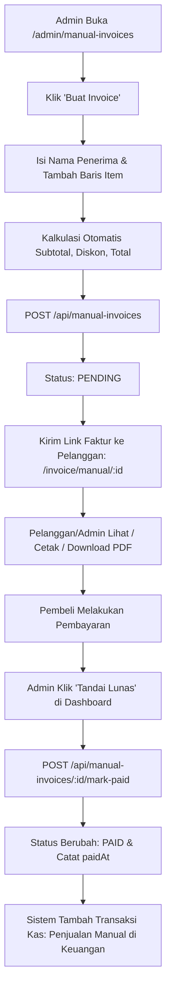

# Panduan Teknis: Sistem Invoice Manual (One-Time Invoice)

## 1. Latar Belakang & Gambaran Umum
Sistem **Invoice Manual** dirancang untuk melayani transaksi di luar siklus penagihan rutin PPPoE/Hotspot (seperti penjualan perangkat keras jaringan: OLT, kabel dropcore, ODP, splitter, modem/ONT, serta jasa instalasi proyek).

### Karakteristik Utama:
- **Standalone**: Tidak terikat pada entitas `pppoeUser` maupun data pelanggan terdaftar.
- **Bisa Dilihat Kapan Saja**: Faktur dapat diakses melalui link publik (`/invoice/manual/[id]`) baik sebelum dibayar (status `PENDING`) maupun setelah lunas (`PAID`).
- **Penomoran Otomatis**: Memakai format resmi `MINV-YYYYMMDD-XXXXXX`.
- **Integrasi Keuangan Otomatis**: Saat admin menandai faktur sebagai **LUNAS**, sistem otomatis menyuntikkan catatan transaksi pemasukan (`INCOME`) pada modul Keuangan dengan kategori *"Penjualan Manual"*.
- **Cetak & Unduh PDF**: Menggunakan mesin PDF server-side berbasis tema Oceanic Blue (`#002C60`).

---

## 2. Struktur Database (Schema)

Model Prisma: `manualInvoice` (tabel: `manual_invoices`):
```prisma
model manualInvoice {
  id               String              @id @default(cuid())
  invoiceNumber    String              @unique // Format: MINV-YYYYMMDD-XXXXXX
  recipientName    String
  recipientPhone   String?
  recipientAddress String?             @db.Text
  items            Json                // [{description, qty, unitPrice, total}]
  subtotal         Int
  discountAmount   Int                 @default(0)
  totalAmount      Int
  status           ManualInvoiceStatus @default(PENDING)
  notes            String?             @db.Text
  paidAt           DateTime?
  transactionId    String?             // ID transaksi di tabel transactions
  createdBy        String?             // Email / ID Admin
  createdAt        DateTime            @default(now())
  updatedAt        DateTime            @updatedAt

  @@index([status])
  @@index([createdAt])
  @@map("manual_invoices")
}

enum ManualInvoiceStatus {
  PENDING
  PAID
  CANCELLED
}
```

---

## 3. Kontrak API

| Method | Endpoint | Deskripsi | Hak Akses |
|---|---|---|---|
| `GET` | `/api/manual-invoices` | List invoice + summary stats | Admin Session |
| `POST` | `/api/manual-invoices` | Buat invoice manual baru | Admin Session |
| `GET` | `/api/manual-invoices/[id]` | Detail invoice + info bank perusahaan | Publik |
| `PUT` | `/api/manual-invoices/[id]` | Update data invoice (hanya saat `PENDING`) | Admin Session |
| `DELETE` | `/api/manual-invoices/[id]` | Hapus invoice | Admin Session |
| `POST` | `/api/manual-invoices/[id]/mark-paid` | Tandai lunas & catat pemasukan kas | Admin Session |
| `GET` | `/api/manual-invoices/[id]/pdf` | Download dokumen PDF resmi | Publik |

---

## 4. Alur Kerja (Workflow)



---

## 5. Cara Eksekusi Migrasi di VPS

Di terminal VPS (`/var/www/EugineBill-radius`):
```bash
# Opsi 1: Menggunakan MySQL CLI langsung
mysql -u EugineBill_user -pEugineBillradius123 EugineBill_radius < prisma/migrations/add_manual_invoices.sql

# Opsi 2: Menggunakan prisma db push
npx prisma db push --skip-generate
```
